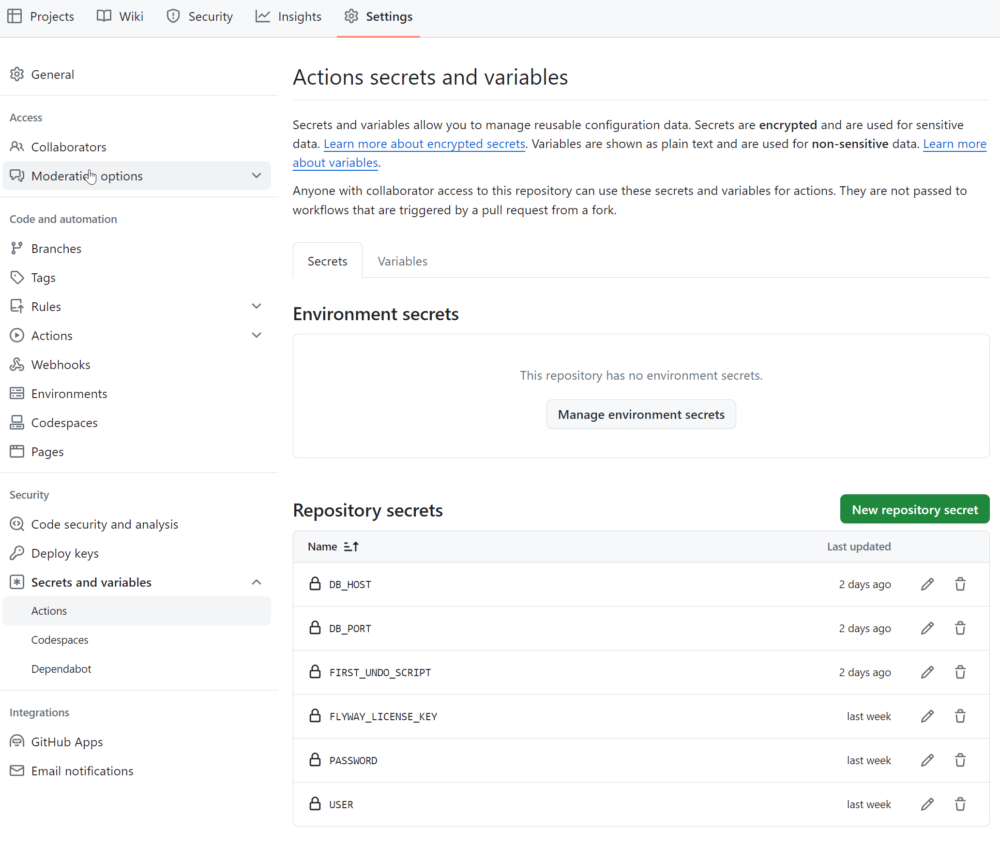
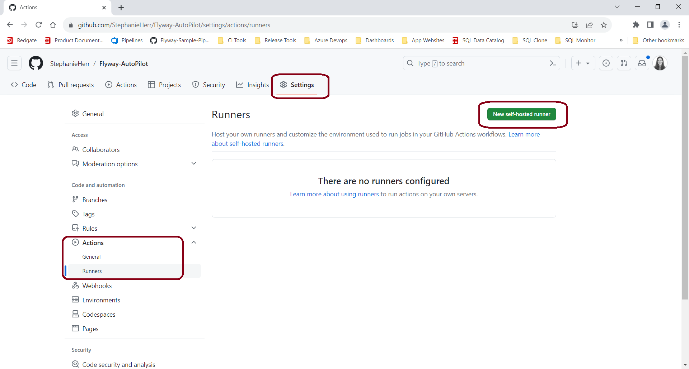
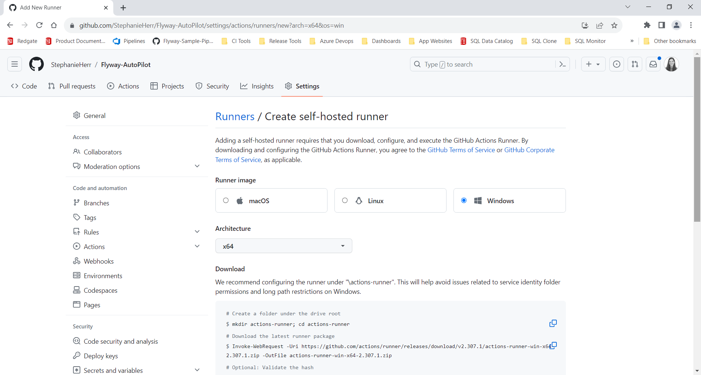
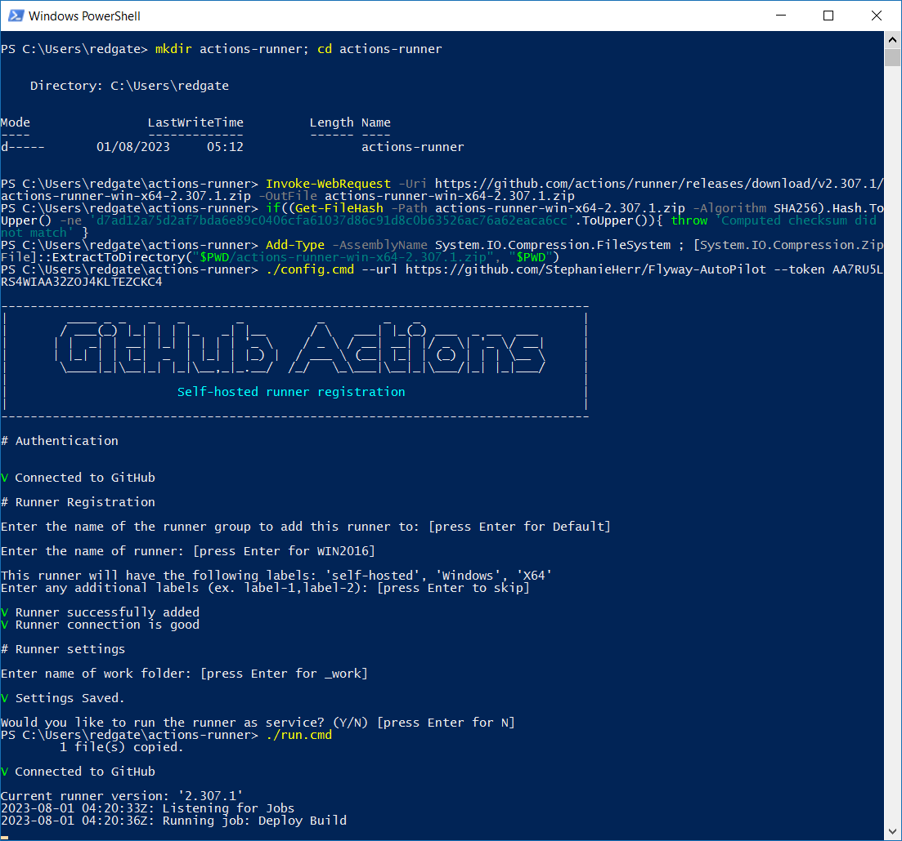

Flyway Autopilot allows you to trial an end-to-end database development and automated deployment process with very little setup.  With Flyway AutoPilot for PostgreSQL, you get: 

## What's Included
1. Two SQL scripts to create the required sample databases (`1-create_autopilot_databases.sql`) and populate each with the initial schema (`2-create_initial_database_schema.sql`)
2. A pre-configured Flyway project to get started quickly
3. Integration with version control to track your changes and collaborate with a team
4. Example migration scripts that are already deployed to the sample databases and the ability to generate new migration scripts (both versioned and undo scripts)
5. A GitHub Actions pipeline to facilitate Continuous Integration and Continuous Deployments (CI/CD) across the sample databases
6. Reports to provide more visibility and safety checks integrated into the pipeline

## Requirements
1. A running PostgreSQL instance, preferably local to your machine.
   - [Docker](https://hub.docker.com/_/postgres) is often the easiest way to do this if PostgreSQL is not already available.
2. A compatible IDE like [DBeaver](https://dbeaver.io/download/) or the `psql` command line tool if you're comfortable with that.
3. A GitHub account
4. `git` tooling installed locally and accessible in your path.
5. Flyway Enterprise installed and activated locally. This can be a trial or fully licensed version.

## Getting your environment setup
To follow along with the webinar or online Quickstart guide linked below, you'll need to run follow the steps below.

### Step 1: Clone Repository
Log into GitHub and then clone this repository. You'll have access to the initial Flyway project files and a `main.yaml` pipeline ready to use. If you are new to Git and version control, it might be best to attend the webinar first to see how things work.

### Step 2: Clone the repository locally
Next, you need to clone a copy of your new repository to the development machine where Flyway Desktop and your PostgreSQL IDE are installed. This may also be where you have a PostgreSQL instance running, but it's possible to use a cloud-based PostgreSQL instance, too.

### Step 3: Start or access PostgreSQL
In most cases, the fastest way to access PostgreSQL is to start a Docker container. If you have access to a PostgreSQL instance through a hosted provider or on a different machine that you IP access to, you could use those options too. Just ensure that you have direct IP-based access to the PostgreSQL instance from your development machine.

With Docker installed on your development machine, the following example Docker command will provide access to a vanilla PostgreSQL instance using the latest release. Change the password as necessary.

```
docker run --name fw_autopilot -e POSTGRES_PASSWORD=mysecretpassword -p 5432:5432 -d postgres
```

Once started, connect with your IDE of choice. The initial user for the Docker images is `postgres` and the password is whatever you set `POSTGRES_PASSWORD` to in the above command.

### Step 4: Create project databases and populate initial schema
1. Connect to any database with a user that has the `CREATEDB` privilege (the `postgres` user in the Docker container does).
2. Execute the `1-create_autopilot_databases.sql` script to create all of the databases used in this Quickstart sample. All databases start with the name `widget`.
3. Now one by one, connect to each of the `widget` databases individually and execute the `2-create_initial_database_schema.sql` scripts. This will create a few tables, a view, and a function.

### Step 5: Create GitHub Action secrets used in the sample pipeline
The included `main.yaml` action pipeline requires a few secrets to be set. In GitHub go to `Settings -> Secrets and Variables -> Actions`.

 - DB_HOST: URL or IP of the PostgreSQL instance
 - DB_PORT: 5432 is the default. Your instance might be running on a different port
 - FIRST_UNDO_SCRIPT: 002.20240228211434
 - FLYWAY_LICENSE_KEY: 
 - USER: Postgres username. `postgres` by default
 - PASSWORD: Postgres password for the user

**GitHub Secrets Location**


### Step 6: Configure a GitHub Actions runner on your development machine
1. In GitHub, goto `Settings -> Actions -> Runners`.  
2. Click the "New self-hosted runner" button.



3. Follow the instructions for setting up your self-hosted runner on your Operating System. The images below illustrate how to install the runner using Powershell on Windows. MacOS and Linux will have different commands.



(Using the commands to install via Powershell)



You're now ready to follow the rest of the Quickstart, which includes setting up a local GitHub Actions runner to see the CI/CD pipeline work with your local databases.

**Check out the [documentation to get started](https://documentation.red-gate.com/fd/quickstart-flyway-autopilot-215154689.html)**.
